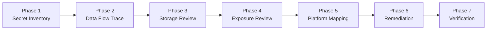

# Windows Desktop Secure Secrets
### (Windows 桌面憑證與機密安全)

> A reusable AI Agent Skill for reviewing, designing, and guiding secure handling of secrets, credentials, and tokens in Windows desktop applications.

[](LICENSE)
[](#)
[](#)

> [!WARNING]
> **Notice / 說明**：本 Skill 由 **[Codex](https://github.com/codex)** 提案規格，由 **Antigravity** ([Google DeepMind](https://deepmind.google/)) 負責架構與代碼開發，並由 **[Sue-Hsu](https://github.com/Sue-Hsu)** 維護發布。請斟酌使用並於生產環境落實安全審查。
> *(This skill was originally proposed by Codex, developed and engineered by Antigravity, and maintained by Sue-Hsu. Please review with discretion in production environments.)*

---

## 1. Introduction

Windows desktop applications frequently need to manage sensitive data, including API keys, OAuth tokens, user passwords, refresh tokens, and private keys. 

However, common user directories such as `%APPDATA%`, framework-specific configuration folders, or virtual local storage paths are merely storage locations—**they are not security sandboxes**. On Windows, files in these directories are standard plaintext filesystem files readable by any application running under the user's account.

This skill equips AI coding agents (such as Antigravity, Cursor, Claude Code, and other LLM assistants) to:
- **Discover and classify** all sensitive credentials and secrets.
- **Trace secret data flows** from input and memory to disk and network.
- **Audit local storage** to eliminate plaintext persistence and custom cryptography.
- **Enforce OS-level protections**, specifically Windows Data Protection API (DPAPI) and Windows Credential Manager.
- **Detect exposure** across debug logs, exception handlers, clipboard operations, export bundles, and backups.
- **Prevent silent fallbacks** to plaintext when secure storage APIs fail.
- **Guide rotation and revocation** when a secret has been committed or leaked.
- **Verify remediations** to ensure fail-closed security.

---

## 2. Why This Skill Exists

Desktop client security differs fundamentally from server-side security. Common vulnerability patterns frequently observed in desktop applications include:

1. **Plaintext Persistence in AppData**: Storing raw API tokens or passwords in `%APPDATA%\MyApp\config.json` or SQLite databases without encryption.
2. **False Security Boundaries**: Relying on `.gitignore` as a security boundary, failing to realize local disk files remain unencrypted.
3. **Silent Fallback to Plaintext**: Swallowing exceptions from encryption APIs and quietly writing unencrypted JSON as a backup plan.
4. **Embedded Client Secrets**: Hardcoding OAuth Client Secrets into desktop binaries, failing to recognize that desktop applications are Public Clients.
5. **Debug Log and Crash Dump Leaks**: Printing authorization headers or full tokens into application logs or crash reports.
6. **Insecure Export and Backup Features**: Offering "Export Settings" or relying on automated cloud folder syncing (e.g., OneDrive) that packages plaintext secrets.
7. **Homegrown Cryptography**: Attempting to hide secrets with Base64 encoding, XOR loops, or hardcoded AES keys.

This skill provides automated guidance to systematically identify and eradicate these patterns.

---

## 3. Scope

### What This Skill Covers
- Secret inventory, classification, and sensitivity tiering.
- Windows OS-level credential management:
  - **Windows Data Protection API (DPAPI)** (`CryptProtectData`, `ProtectedData`, `safeStorage`).
  - **Windows Credential Manager** (`CredWrite`, `PasswordVault`, `keyring`).
- OAuth 2.0 and OIDC for Native Apps (RFC 8252, RFC 7636 PKCE).
- Complete credential lifecycle auditing (Input, Memory, Storage, Transmission, Usage, Logging, Export, Backup, Deletion, Revocation).
- Guidance on credential rotation and Git history scrubbing.
- Framework-specific implementation mappings (.NET, C++, Python, Godot, Electron, Tauri, Qt, Java).

### What This Skill Is NOT
- **Not a Password Manager**: It does not replace enterprise credential vaults like 1Password, Bitwarden, or HashiCorp Vault.
- **Not a Full Penetration-Testing Suite**: It does not perform active runtime fuzzing or exploit payload delivery.
- **Not a General Malware Scanner**: It does not detect trojans, keyloggers, or operating-system-level rootkits.
- **Not a Cryptographic Primitive Library**: It guides the correct invocation of official Windows APIs rather than shipping novel cryptographic implementations.

---

## 4. Supported Use Cases

- **AI-Powered Desktop Applications**: Safely storing LLM provider API keys entered by end users.
- **Desktop Clients with Cloud Authentication**: Securely managing OAuth 2.0 Access and Refresh Tokens for Google, GitHub, or enterprise IdPs.
- **Developer and Database Tools**: Storing database passwords and service connection strings on local machines.
- **Desktop Games and Utilities**: Protecting player authentication tokens in Godot, Unreal, or Unity Windows exports.
- **Pre-Release Security Audits**: Running comprehensive reviews before packaging installers or distributing MSIX/exe packages.

---

## 5. How the Skill Works (7-Phase Workflow)

When this skill is triggered, the AI Agent follows a structured 7-phase audit workflow:



1. **Phase 1 — Secret Inventory**: Identify and categorize all credentials, tokens, keys, and public client identifiers.
2. **Phase 2 — Data Flow Trace**: Follow each secret across its lifecycle (Input → Memory → Storage → Transmission → Logging → Deletion).
3. **Phase 3 — Storage Review**: Audit local disk persistence for plaintext storage, weak hashing, or improper scopes.
4. **Phase 4 — Exposure Review**: Inspect source code, Git history, exception traces, UI elements, and export utilities for leaks.
5. **Phase 5 — Platform Mapping**: Identify the application's runtime language and map to the appropriate Windows API.
6. **Phase 6 — Remediation**: Deliver concrete, framework-correct, fail-closed code rewrites and evaluate rotation needs.
7. **Phase 7 — Verification**: Verify that secure storage is active, exceptions fail safely, and logs remain sanitized.

---

## 6. Core Security Principles

1. **AppData is Storage, Not a Sandbox**: User data directories offer filesystem separation, not cryptographic defense.
2. **Never Persist Plaintext Secrets**: Any secret capable of authentication must never touch disk unencrypted.
3. **Prefer OS-Level Protection**: Delegate key management to Windows Credential Manager or DPAPI (`CurrentUser`).
4. **No Homegrown Crypto or Hardcoded Keys**: Avoid Base64, custom XOR loops, and embedded AES keys in binaries.
5. **Fail Closed (Zero Silent Fallback)**: If secure storage fails, halt or downgrade to transient session memory—never silently dump plaintext.
6. **Audit the Full Lifecycle**: Defend secrets during input, in-memory residence, network transit, logging, and deletion.
7. **UI and Log Masking**: Mask inputs by default and sanitize exception outputs and logging calls.
8. **Desktop Apps are Public Clients**: Never embed OAuth Client Secrets in desktop binaries; enforce PKCE (RFC 7636).
9. **Separate Secrets from Preferences**: Keep window sizes and themes in standard JSON; reserve DPAPI/Vaults for actual credentials.
10. **Rotate Leaked Secrets**: If a key touched Git or a log file, removing it is insufficient—it must be revoked and rotated.

---

## 7. Installation

You can install this skill into any agent system compatible with standard Agent Skills:

### Option A: Direct Git Clone
Clone into your Agent's local or global skills directory:

```bash
# Example for Antigravity / Gemini CLI configuration
git clone https://github.com/your-username/windows-desktop-secure-secrets.git ~/.gemini/config/skills/windows-desktop-secure-secrets

# Example for Cursor or custom agent workspace
git clone https://github.com/your-username/windows-desktop-secure-secrets.git .agents/skills/windows-desktop-secure-secrets
```

### Option B: Project-Level Inclusion
Copy the repository files directly into your project's `.agent/skills/` or `skills/` directory.

---

## 8. Usage

Trigger the skill in your AI assistant by asking questions or providing audit prompts:

- *"Review this Windows desktop project for unsafe secret and credential storage."*
- *"Audit our API key and OAuth token handling using windows-desktop-secure-secrets."*
- *"Check whether our Godot / .NET / Electron app stores credentials securely."*
- *"We are preparing for release. Verify that no secrets leak into AppData, logs, or exports."*

---

## 9. Example Findings

All findings emitted by the skill follow an actionable format with severity, code diffs, and rotation guidance.

### Example 1: Plaintext Storage in User Directory

```markdown
### [High] SEC-001: Plaintext API Key Persisted in AppData

- **File / Location**: `src/config/storage.py:42`
- **Secret Type**: API Key (Cloud Provider)
- **Current Behavior**:
  The application writes user-provided API keys directly to `%APPDATA%\MyApp\settings.json` using raw `json.dump()`.
- **Risk**:
  Any non-elevated process or malware running under the same user account can read this file in plaintext without requiring administrator privileges.
- **Recommended Fix**:
  Use the Windows Credential Manager via the `keyring` package to isolate credentials from ordinary preferences.
- **Concrete Code Snippet**:
  ```python
  import keyring

  # Save to Windows Credential Manager
  keyring.set_password("MyDesktopApp", "cloud_api_key", api_key)
  ```
- **Platform / Framework Consideration**:
  Ensure the active backend is `WinVaultKeyring` and fail closed if unavailable.
- **Rotation Required**:
  No, provided the local machine has not been compromised and the file was never committed or backed up to an external service.
```

### Example 2: Committed Credentials in Repository History

```markdown
### [Critical] SEC-002: Hardcoded Production Client Secret Committed to Git

- **File / Location**: `Assets/Scripts/OAuthService.cs:14`
- **Secret Type**: OAuth Client Secret
- **Current Behavior**:
  An OAuth Client Secret is hardcoded in source code and present in past Git commit history.
- **Risk**:
  Desktop applications are Public Clients. Anyone with repository access or decompilation tools can extract this secret to impersonate the application.
- **Recommended Fix**:
  Migrate to OAuth 2.0 Authorization Code Flow with PKCE (Proof Key for Code Exchange) where no Client Secret is stored on the client.
- **Rotation Required**:
  **Yes**. Revoke the compromised secret immediately in the cloud provider console and purge repository history using `git-filter-repo`.
```

---

## 10. Framework Mapping

This skill is designed to be **framework-agnostic**. The core principles apply universally, while framework-specific implementations are detailed in [`references/framework-mapping.md`](references/framework-mapping.md):

| Framework / Language | Recommended Mechanism | Reference Guide |
|---|---|---|
| **.NET / C#** (WPF, WinUI, MAUI) | `ProtectedData` (DPAPI CurrentUser), `PasswordVault` | [`examples/dotnet-dpapi.md`](examples/dotnet-dpapi.md) |
| **Electron** (Node.js) | `safeStorage` (Main Process only) | [`examples/electron-safestorage.md`](examples/electron-safestorage.md) |
| **Python Desktop** (PyQt, Tkinter) | `keyring` (Windows Credential Manager) | [`examples/python-keyring.md`](examples/python-keyring.md) |
| **Godot Engine** (4.x / 3.x) | C# `ProtectedData` or GDExtension DPAPI | [`examples/godot-credentials.md`](examples/godot-credentials.md) |
| **C / C++** (Win32, MFC) | `CryptProtectData` (Crypt32), `CredWriteW` (Advapi32) | [`references/framework-mapping.md`](references/framework-mapping.md) |
| **Tauri** (Rust) | `keyring` crate via Tauri IPC Commands | [`references/framework-mapping.md`](references/framework-mapping.md) |
| **Qt** (C++ / Python) | `QtKeychain` library | [`references/framework-mapping.md`](references/framework-mapping.md) |
| **Java Desktop** | JNA wrapper for `Crypt32Util` | [`references/framework-mapping.md`](references/framework-mapping.md) |

---

## 11. Threat Model & Limitations

Understanding what OS-level security can and cannot do is essential:

- **At-Rest Protection**: Windows DPAPI and Credential Manager protect data *at rest* against offline attacks, disk theft, and cross-account unauthorized access.
- **Same-User Malicious Processes**: Any untrusted software executing with the same Windows user privileges can theoretically invoke `CryptUnprotectData` to decrypt DPAPI data. For highly sensitive workflows (e.g., cryptocurrency wallets), combine DPAPI with user-supplied master passwords or Windows Hello.
- **Static Review Boundaries**: Static analysis cannot fully guarantee runtime memory safety (e.g., memory dumps or process injection).
- **Third-Party Providers**: Cloud IdP policy configurations and external token validity remain outside local client control.

---

## 12. Security Notes

- **Synthetic Examples**: Never commit real API keys, tokens, or credentials to this repository. All examples must use synthetic placeholders.
- **Redaction**: Always mask secrets in audit outputs (e.g., `sk-ant-****xyz`).
- **Fail-Closed Verification**: Always test the application's behavior when Windows credential storage APIs throw exceptions.

---

## 13. Project Structure

```text
windows-desktop-secure-secrets/
├── SKILL.md                              # Main agent skill definition and instructions
├── README.md                             # English documentation and usage guide
├── README.zh-TW.md                       # Traditional Chinese documentation
├── LICENSE                               # MIT License
├── .gitignore                            # Git exclusion rules
├── references/                           # Detailed technical reference guides
│   ├── windows-secret-storage.md         # In-depth DPAPI & Credential Manager mechanics
│   ├── framework-mapping.md              # Cross-framework implementation guide
│   ├── oauth-desktop-security.md         # Public Clients, PKCE, and desktop OAuth
│   └── credential-lifecycle.md           # 11-stage secret lifecycle tracking
└── examples/                             # Practical implementation examples
    ├── dotnet-dpapi.md                   # C# / .NET implementation
    ├── electron-safestorage.md           # Electron Main process implementation
    ├── python-keyring.md                 # Python keyring implementation
    └── godot-credentials.md              # Godot 4.x credential management
```

---

## 14. References & Inspiration

This skill was independently developed and drew conceptual inspiration from:
- [superagent-ai/skills](https://github.com/superagent-ai/skills) (specifically `crypto-secrets` for secrets hygiene and structured reporting).
- [agents-inc/skills](https://github.com/agents-inc/skills) (specifically `desktop-storage-electron` for architectural separation of preferences and credentials).

*Note: This project is independently authored and is not affiliated with or endorsed by those repositories.*

---

## 15. License

This project is licensed under the [MIT License](LICENSE).

---

## 16. Contributing

Contributions are welcome! We appreciate improvements in:
- Additional framework mappings (e.g., Flutter Desktop, Go/Fyne).
- Nuanced threat model considerations and mitigation patterns.
- Expanded automated test patterns and verification checklists.

---

## 17. Contributors & Credits

Special thanks to the primary contributors and AI coding partners:

- **[Sue-Hsu](https://github.com/Sue-Hsu)** - Project Owner & Maintainer
- **[Codex](https://github.com/codex)** ([OpenAI](https://openai.com/)) - Initial Skill Proposal & Architecture Specification
- **Antigravity** ([Google DeepMind](https://deepmind.google/)) - Core Engine Development, Security Rules Implementation & Verification

---

## 18. Disclaimer

This skill provides automated security guidance and review assistance. It does not replace a comprehensive professional cybersecurity audit and does not guarantee that an application is completely impervious to all attack vectors.
