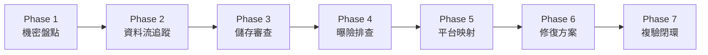

# Windows 桌面憑證與機密安全
### (Windows Desktop Secure Secrets)

> 用於審查、設計與指導 Windows 桌面應用程式安全處理金鑰 (Secret)、憑證 (Credential) 與 Token 的通用型 AI Agent 技能 (Skill)。

[](LICENSE)
[](#)
[](#)

> [!WARNING]
> **說明**：本 Skill 由 **[Sue-Hsu](https://github.com/Sue-Hsu)** 獨立發布與維護，由 AI 協作製作（包含 **[Codex](https://github.com/openai/codex)** 提供初始規格建議，以及 **Antigravity** 協助核心實作與驗收）。在生產環境應用或重構關鍵資安架構前，請務必依專案特定的威脅模型進行嚴格安全審核。

---

## 1. 簡介 (Introduction)

Windows 桌面應用程式經常需要持久化保存各類機密資料，包含 API Key、OAuth Token、使用者帳號密碼、Refresh Token 以及私鑰。

然而，一般常見的使用者目錄，例如 `%APPDATA%`、框架專屬設定目錄或虛擬本地儲存路徑，僅僅代表具備磁碟寫入與資料持久化能力——**它們絕非安全沙盒**。檔案存放在 AppData 或其他使用者資料目錄中，不會因為其所在位置而自動獲得機密資料保護；若未經作業系統層級密碼學保護（如 DPAPI），存放在內的檔案本質仍是標準檔案系統物件，本機同使用者權限下運行的任何程式均能直接讀取。

本技能旨在裝備 AI 編程助手（如 Antigravity、Cursor、Claude Code 等各類 LLM Agent）：
- **盤點與分類**所有敏感憑證與機密資訊。
- **追蹤機密資料流向**（自輸入、記憶體駐留、磁碟落地至網路傳輸）。
- **審查本地儲存狀態**，徹底消滅明文持久化與自創弱加密。
- **強制採用 Windows OS 等級保護**，優先整合 Windows DPAPI 與 Windows Credential Manager。
- **排查曝險節點**，涵蓋除錯日誌、例外訊息、剪貼簿操作、設定匯出與雲端備份。
- **杜絕 Silent Fallback**（防範加密失敗時悄悄改存明文）。
- **指導金鑰撤銷與輪替 (Rotation & Revoke)**。
- **複驗修復成果**，確保達到 Fail-Closed 安全邊界。

---

## 2. 為什麼需要此技能？ (Why This Skill Exists)

桌面客戶端的安全邊界與伺服器端有著根本性的差異。在桌面專案中，開發者常無意間落入以下高危漏洞陷阱：

1. **AppData 明文儲存**：將 API Key 或密碼直接寫入 `%APPDATA%\MyApp\config.json` 或本機 SQLite 資料庫中。
2. **誤把 `.gitignore` 當安全邊界**：認為只要不把設定檔 Commit 進 Git 就很安全，忽視了本地磁碟上的明文曝險。
3. **加密失敗時悄悄退回明文 (Silent Fallback)**：在 `catch` 區塊中為了防止程式崩潰，自動將未加密字串寫入備用 JSON。
4. **桌面端內嵌 Client Secret**：在桌面二進位檔中寫死 OAuth 2.0 Client Secret，忽略桌面應用本質為 Public Client。
5. **除錯日誌與崩潰報告洩漏**：直接在 `console.log` 或 `logger.debug` 印出含有 Token 的完整請求或字串。
6. **不安全的匯出與備份**：提供「匯出設定」功能，或依賴 OneDrive 自動備份 `%APPDATA%`，導致機密被打包上傳。
7. **自創密碼學**：誤將 Base64 編碼當成加密，或在程式碼中 Hardcode 一組 AES 金鑰用來加密設定。

本技能提供標準化、自動化的審查導航，協助 Agent 系統性地根除這些安全缺陷。

---

## 3. 範疇與邊界 (Scope)

### 本技能涵蓋範疇
- 機密盤點、分類與敏感等級劃分。
- Windows 作業系統原生機密管理機制：
  - **Windows Data Protection API (DPAPI)** (`CryptProtectData`, `ProtectedData`, `safeStorage`)
  - **Windows Credential Manager** (`CredWrite`, `PasswordVault`, `keyring`)
- 桌面原生應用的 OAuth 2.0 / OIDC 架構規範 (RFC 8252, RFC 7636 PKCE)。
- 完整 11 節點憑證生命週期審查（輸入、記憶體、儲存、傳輸、使用、日誌、錯誤處理、匯出、備份、刪除、輪替撤銷）。
- 外洩金鑰之撤銷、輪替與 Git 歷史清除指導。
- 跨技術棧實作對應（.NET、C++、Python、Godot、Electron、Tauri、Qt、Java）。

### 本技能不包含 (What It Is NOT)
- **非密碼管理器 (Password Manager)**：不取代 1Password、Bitwarden 或企業級金鑰庫。
- **非滲透測試攻擊套件**：不執行黑箱模糊測試 (Fuzzing) 或 Exploit 載荷攻擊。
- **非惡意軟體掃描器**：不負責偵測系統級木馬、鍵盤側錄程式或 Rootkit。
- **非自創加密演算法庫**：引導正確呼叫 Windows 官方原生 API，不提供自訂密碼學演算法。

---

## 4. 支援的使用情境 (Supported Use Cases)

- **AI 驅動型桌面工具**：安全儲存使用者自行輸入的各類 LLM Provider API Key。
- **具備雲端驗證之桌面客戶端**：安全管理 Google、GitHub 或企業 IdP 之 OAuth Access/Refresh Token。
- **開發者與資料庫工具**：安全保存資料庫連線密碼與服務憑證。
- **獨立遊戲與桌面工具**：在 Godot、Unreal 等 Windows 導出版本中保護玩家授權 Token。
- **軟體發布前之資安稽核**：在打包安裝檔 (Installer) 或封裝 MSIX 前進行全生命週期安全把關。

---

## 5. 審查作業流程：7 階段程序 (How the Skill Works)

當觸發本技能時，AI Agent 將嚴格遵循 7 階段標準程序執行審查：



1. **Phase 1 — Secret Inventory (盤點與分類)**：列出所有涉及的憑證、Token、金鑰與公開識別碼。
2. **Phase 2 — Data Flow Trace (資料流追蹤)**：追蹤每個機密自輸入、記憶體、儲存、傳輸至銷毀的全路徑。
3. **Phase 3 — Storage Review (儲存審查)**：檢驗磁碟落地型態是否包含明文、弱加密或錯誤作用域。
4. **Phase 4 — Exposure Review (曝險排查)**：檢查原始碼、Git 歷史、例外紀錄、UI 呈現與匯出模組。
5. **Phase 5 — Platform Mapping (平台映射)**：識別專案所屬之語言框架，匹配最適 Windows API。
6. **Phase 6 — Remediation (修復方案)**：提供框架正確、Fail-Closed 的具體修復代碼，並判定是否需輪替。
7. **Phase 7 — Verification (複驗閉環)**：驗證加密生效、例外時安全終止、日誌脫敏無殘留。

---

## 6. 核心安全原則 (Core Security Principles)

1. **使用者目錄不等於安全沙盒**：`AppData` 僅提供檔案隔離，無密碼學保護。
2. **禁止明文持久化機密**：任何具備身分代表性之憑證嚴禁明文寫入磁碟。
3. **優先採用 OS-Level 機制**：將金鑰管理委由 Windows Credential Manager 或 DPAPI (`CurrentUser`)。
4. **禁止自創加密與 Hardcode 金鑰**：嚴禁 Base64、自創 XOR 或在程式碼內嵌入靜態 AES Key。
5. **Fail-Closed 原則（防範 Silent Fallback）**：安全儲存不可用時，必須中斷或退回純記憶體暫存，絕不得自動寫入明文。
6. **全生命週期防護**：全流程檢驗輸入遮罩、記憶體擦除、傳輸加密、日誌過濾與登出銷毀。
7. **UI 與輸出防護**：輸入框預設遮罩，除錯主控台與例外堆疊嚴禁輸出完整數值。
8. **桌面端為 Public Client**：二進位檔無法保密 Client Secret，必須強制採用 PKCE (RFC 7636)。
9. **機密與普通偏好嚴格分離**：視窗大小與主題存於 JSON；真正的機密存入專屬受保護儲存區。
10. **外洩金鑰必須輪替**：只要機密曾進入 Git 或日誌，單純刪除檔案無效，必須立即撤銷並重新核發。

---

## 7. 安裝與設定 (Installation)

您可以將此技能直接導入任何相容標準 Agent Skills 規範之 AI 輔助開發工具（如 Antigravity、Claude Code、Cursor 或 Codex）。

> [!NOTE]
> 不同 AI Agent 系統具備各自獨立的技能探索機制與目錄慣例。請參閱您所使用之 Agent 官方文件以確認目標路徑。

### 已驗證之路徑範例

- **Antigravity / Gemini CLI（全域目錄）**:
  ```bash
  git clone https://github.com/Sue-Hsu/windows-desktop-secure-secrets.git ~/.gemini/config/skills/windows-desktop-secure-secrets
  ```
- **Claude Code（使用者 / 專案目錄）**:
  ```bash
  # 專案層級或特定工具目錄路徑
  git clone https://github.com/Sue-Hsu/windows-desktop-secure-secrets.git .claude/skills/windows-desktop-secure-secrets
  ```
- **Cursor / 一般 Agent 工作區**:
  ```bash
  git clone https://github.com/Sue-Hsu/windows-desktop-secure-secrets.git .agents/skills/windows-desktop-secure-secrets
  ```

---

## 8. 使用方式 (Usage)

在您的 AI Agent 對話框中輸入相關指示即可自動觸發本技能：

- *「請審查這個 Windows 桌面專案是否存在不安全的機密或憑證儲存。」*
- *「使用 windows-desktop-secure-secrets 技能檢查我們專案的 API Key 與 OAuth Token 流程。」*
- *「檢查我們的 Godot / .NET / Electron 桌面應用是否符合 Windows 安全儲存規範。」*
- *「專案準備 Release，請全面稽核是否有金鑰洩漏至 AppData、Log 或設定匯出檔中。」*

---

## 9. 範例報告 (Example Findings)

本技能產出之所有 Finding 均採用高度結構化格式，包含嚴重度、代碼對照與風險評估更換指示（以下均為虛構示範資料）：

### 範例一：使用者目錄明文儲存

````markdown
### [High] SEC-001: API Key 明文持久化於 AppData

- **檔案位置**: `src/config/storage.py:42`
- **機密類型**: API Key (第三方雲端服務)
- **當前行為**:
  應用程式使用 `json.dump()` 將使用者輸入的 API Key 直接寫入 `%APPDATA%\MyApp\settings.json`。
- **資安風險**:
  任何在同一 Windows 使用者帳號下運行的非特權程式或惡意軟體，均可直接讀取此 JSON 檔案竊取金鑰。
- **建議修復方式**:
  改用 `keyring` 套件將憑證存入 Windows 憑證管理員 (Credential Manager)，一般設定則維持於 JSON。
- **修正程式碼**:
  ```python
  import keyring

  # 存入 Windows 憑證管理員
  keyring.set_password("MyDesktopApp", "cloud_api_key", api_key)
  ```
- **框架考量**:
  確認 active backend 為 `WinVaultKeyring`，若不可用應採取 Fail-Closed。
- **需要撤銷與更換憑證 (Rotation Required)**:
  **No**（依威脅模型評估：該 API Key 僅短暫存在於受控本機開發者磁碟，未曾被 Commit 至 Git、未被寫入 Log 或雲端備份，且主機無受害跡象。但必須立即刪除明文檔案並遷移至憑證管理員）。
````

### 範例二：Git 歷史洩漏機密

````markdown
### [Critical] SEC-002: 生產環境 Client Secret 寫入原始碼並已 Commit

- **檔案位置**: `Assets/Scripts/OAuthService.cs:14`
- **機密類型**: OAuth Client Secret
- **當前行為**:
  程式碼中寫死 OAuth Client Secret，且該字串已存在於 Git 過去的 Commit 歷史中。
- **資安風險**:
  桌面應用程式為 Public Client，任何人取得專案儲存庫或對二進位檔進行反編譯皆可輕易抽出該 Secret 冒充客戶端身分。
- **建議修復方式**:
  轉移至 OAuth 2.0 Authorization Code Flow with PKCE 流程，客戶端完全不持有 Client Secret。
- **需要撤銷與更換憑證 (Rotation Required)**:
  **Yes**。立即於服務商控制台作廢該 Secret，並使用 `git-filter-repo` 徹底抹除 Git 歷史。
````

---

## 10. 跨技術棧對照 (Framework Mapping)

本技能核心保持**框架無關 (Framework-Agnostic)**，具體實作指引收錄於 [`references/framework-mapping.md`](references/framework-mapping.md)：

| 框架 / 語言 | 建議 Windows 機制 | 實作範例 |
|---|---|---|
| **.NET / C#** (WPF, WinUI, MAUI) | `ProtectedData` (DPAPI CurrentUser), `PasswordVault` | [`examples/dotnet-dpapi.md`](examples/dotnet-dpapi.md) |
| **Electron** (Node.js) | `safeStorage` (僅限 Main Process) | [`examples/electron-safestorage.md`](examples/electron-safestorage.md) |
| **Python Desktop** (PyQt, Tkinter) | `keyring` (Windows Credential Manager) | [`examples/python-keyring.md`](examples/python-keyring.md) |
| **Godot Engine** (4.x / 3.x) | C# `ProtectedData` 或 GDExtension DPAPI | [`examples/godot-credentials.md`](examples/godot-credentials.md) |
| **C / C++** (Win32, MFC) | `CryptProtectData` (Crypt32), `CredWriteW` (Advapi32) | [`references/framework-mapping.md`](references/framework-mapping.md) |
| **Tauri** (Rust) | 原生 OS `keyring` crate (CredMgr) / `crypt32`；或 `tauri-plugin-stronghold` (應用層 vault) | [`references/framework-mapping.md`](references/framework-mapping.md) |
| **Qt** (C++ / Python) | `QtKeychain` 函式庫 (Windows Credential Store) | [`references/framework-mapping.md`](references/framework-mapping.md) |
| **Java Desktop** | JNA 調用 `Crypt32Util` | [`references/framework-mapping.md`](references/framework-mapping.md) |

---

## 11. 威脅模型與局限性說明 (Threat Model & Limitations)

正確理解作業系統級防護的防衛邊界至關重要：

- **靜態防禦 (At-Rest Protection)**：Windows DPAPI 與 Credential Manager 主要防範離線分析、硬碟遭拔除拔取，以及同主機上其他非管理員帳號的跨帳號偷讀。
- **同使用者惡意軟體邊界**：若惡意軟體以與使用者相同的身分在背景運行，理論上亦可調用 `CryptUnprotectData` 解密資料。對於超高敏感度情境（如私鑰），應結合使用者自訂主密碼或 Windows Hello 生物辨識。
- **靜態審查局限**：靜態審查無法保證執行時期記憶體安全（如 Process Dump 或記憶體注入）。
- **外部 IdP 政策**：外部雲端身分提供商之 Token 過期與輪替政策，非本機客戶端能單方面決定。

---

## 12. 資安注意事項 (Security Notes)

- **完全採用虛擬資料**：本儲存庫中所有範例與文檔均採用假資料，絕不包含真實金鑰。
- **報告脫敏**：審查產出時，必須對敏感數值進行遮罩（例如 `sk-ant-****xyz`）。
- **Fail-Closed 驗證**：在開發過程中，必須實測加密服務不可用時，程式是否能安全拒絕寫入明文。

---

## 13. 專案目錄結構 (Project Structure)

```text
windows-desktop-secure-secrets/
├── SKILL.md                              # 主技能定義與 Agent 運作規則
├── README.md                             # 英文主說明文檔
├── README.zh-TW.md                       # 繁體中文說明文檔
├── LICENSE                               # MIT 授權條款
├── .gitignore                            # Git 過濾規則
├── references/                           # 核心技術指引
│   ├── windows-secret-storage.md         # DPAPI 與 Credential Manager 底層原理與威脅模型
│   ├── framework-mapping.md              # 跨技術棧實作對照指南
│   ├── oauth-desktop-security.md         # 桌面 Public Client 與 PKCE 安全規範
│   └── credential-lifecycle.md           # 11 節點憑證全生命週期追蹤
├── examples/                             # 具體實作範例代碼
│   ├── dotnet-dpapi.md                   # C# / .NET 實作
│   ├── electron-safestorage.md           # Electron Main Process 實作
│   ├── python-keyring.md                 # Python keyring 實作
│   └── godot-credentials.md              # Godot 4.x 實作
└── evals/                                # 確定性回歸評估測試套件
    ├── README.md                         # 評估套件文檔與測試指引
    ├── test-cases.json                   # 結構化測試案例、預期判定與輪替標準
    └── fixtures/                         # 脆弱與合規微型測試代碼
        ├── case1_storage.py              # Case 1: AppData 明文儲存 API Key
        ├── case2_oauth_service.cs        # Case 2: 原始碼硬編碼 Client Secret 與日誌輸出
        └── case3_secure_dpapi.cs         # Case 3: 正確合規之 DPAPI CurrentUser 與 Fail-Closed
```

---

## 14. 參考來源與致謝 (References & Inspiration)

本專案為獨立創作之通用技能，在設計理念上借鑑並致敬：
- [superagent-ai/skills](https://github.com/superagent-ai/skills)（參考其 `crypto-secrets` 技能之安全衛生檢核與審查報告規範）。
- [agents-inc/skills](https://github.com/agents-inc/skills)（抽取其 `desktop-storage-electron` 技能中關於「一般偏好與機密隔離儲存」之桌面架構精神）。

*聲明：本專案為獨立開發，與上述專案無附屬或背書關係。*

---

## 15. 授權條款 (License)

本專案基於 [MIT License](LICENSE) 開源授權發布。

---

## 16. 參與貢獻 (Contributing)

歡迎社群夥伴提供貢獻！期待在以下領域共同完善：
- 擴充更多框架映射（如 Flutter Desktop、Go/Fyne、Rust Native 等）。
- 補充更多 Windows 原生安全威脅模型分析與防禦樣式。
- 完善測試用例與自動化檢查清單。

---

## 17. 貢獻者與致謝 (Contributors & Credits)

特別致謝專案發起人與 AI 開發協作夥伴：

- **[Sue-Hsu](https://github.com/Sue-Hsu)** - 專案發起人與維護者 (Project Owner & Maintainer)
- **[Codex](https://github.com/openai/codex)** ([OpenAI](https://openai.com/)) - 初始規格建議 (Initial specification assistance)
- **Antigravity** ([Google DeepMind](https://deepmind.google/)) - 核心實作協助與驗收流程 (Implementation assistance & verification)

---

## 18. 免責聲明 (Disclaimer)

本技能提供自動化安全指導與代碼審查輔助。它不能取代全面的專業網路安全滲透測試，亦無法保證應用程式在所有未知攻擊向量下絕對安全。
