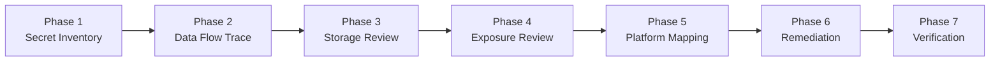

# Windows Desktop Secret and Credential Security

本技能為 **Windows 桌面應用程式通用型金鑰、憑證與機密安全架構規範與審查技能**。
適用於所有在 Windows 作業系統上運行的桌面應用程式（涵蓋 **Godot、.NET / C#、C++、Python desktop、Electron、Tauri、Qt、Java desktop** 等各類桌面框架與引擎）。

本技能的核心目標是確保 Windows 桌面應用中的機密資料在全生命週期中獲得 **Windows OS 等級** 的保護，嚴格消除「將使用者資料目錄誤當安全沙盒」、「明文儲存機密」、「自創加密」、「Silent Fallback to Plaintext」及「Public Client 誤用 Client Secret」等常見重大資安漏洞。

> [!WARNING]
> **說明 (Notice)**：本 Skill 由 **[Sue-Hsu](https://github.com/Sue-Hsu)** 獨立發布與維護，由 AI 協作製作（包含 **[Codex](https://github.com/openai/codex)** 提供初始規格建議，以及 **Antigravity** 協助核心實作與驗收）。在生產環境應用或重構關鍵資安架構前，請務必依專案特定的威脅模型進行嚴格安全審核。

---

## When to Use (適用時機)

當 Agent 在 Windows 桌面應用專案中進行架構設計、程式碼審查 (Code Review)、弱點稽核或功能實作，且涉及以下任一情境時**必須啟用**本技能：

- **機密資料類型**：
  - API Key、第三方服務金鑰、Webhook Secret
  - 使用者密碼、資料庫密碼、服務認證密碼
  - OAuth Access Token、OAuth Refresh Token、ID Token（敏感身分斷言）、Session Token
  - Client Secret（評估桌面客戶端身分安全性）
  - 長期密碼學私鑰 (Private Key)、憑證檔案 (PFX/PEM)、對稱加解密金鑰
  - 任何可用於驗證、授權或冒用身分之敏感憑證資料
- **儲存與認證架構**：
  - 設計或審查本地持久化儲存（Local Storage, Settings, Database, Config files）
  - 評估或實作 Windows 原生安全機制（Windows Credential Manager、Windows DPAPI、CNG/TPM、Windows Certificate Store）
  - 桌面應用整合 OAuth 2.0 / OpenID Connect (OIDC) / Google Login / GitHub Login 等身分驗證流程
  - 檢視桌面程式的設定檔匯出、備份、除錯日誌或錯誤回報機制

---

## When NOT to Use (不適用時機)

本技能**不應**套用於非機密性之一般應用程式偏好設定：

- 一般 UI 外觀與佈局：視窗大小與位置、最後開啟分頁、側邊欄展開狀態
- 非敏感偏好：主題（深色/淺色）、多國語言設定 (Locale)、字型大小
- 效能與暫存資料：公開資源快取、離線靜態縮圖、不含個資的非敏感計數器
- 公開端點與識別碼：公開 API Endpoint URL、Public Client ID、非敏感的版本號碼

> [!NOTE]
> 嚴格區分 **Secret (機密)** 與 **Non-secret Preference (非敏感設定)**。非敏感設定應使用一般檔案（JSON/INI/SQLite）保存，不得無端套用 DPAPI 或 Credential Manager 增加無謂複雜度；反之，真正的 Secret 絕對禁止當成普通設定明文保存。

---

## 13 大核心安全原則 (Core Security Principles)

1. **使用者資料目錄不等於安全 Secret Storage**
   檔案存放在 `AppData`、`LocalLow`、`Roaming`、Godot `user://` 或各框架的 user data directory 中，**不會因為其所在位置而自動獲得機密資料保護**。該目錄本質僅是作業系統的標準檔案系統儲存位置，若未經過 DPAPI 或其他密碼學保護，存放在內的檔案即為未受保護之明文，本機同使用者權限之軟體皆能直接讀取。
2. **禁止敏感資料明文持久化**
   所有可用於驗證、授權或代表身分的 Secret，絕對禁止以明文形式直接持久化於磁碟。
3. **禁止明文寫入程式碼或專案檔案**
   Secret 不得直接明文寫入專案目錄、原始碼、Git 追蹤檔案、JSON、INI、CFG、YAML、XML、本地 SQLite 資料庫、除錯日誌 (Log)、當機報告 (Crash Report)、除錯輸出 (Debug Console)、設定匯出檔、備份檔案或暫存檔案中。
4. **`.gitignore` 不是安全防線**
   將包含 Secret 的設定檔加入 `.gitignore` 僅能避免被 Git 追蹤，無法防止本機其他未授權程式、惡意軟體或具備存取權限的非管理員帳號直接自磁碟讀取明文。
5. **優先採用 Windows OS-Level 安全保護**
   應依據專案所屬之程式語言與執行時期環境，優先整合：
   - **Windows Credential Manager**（認證憑證首選，儲存於 OS 專屬 Vault，上限 2560 Bytes）
   - **Windows Data Protection API (DPAPI)**（對稱加密首選，由 Windows 使用者登入金鑰派生保護）
   - **Windows Certificate Store / CNG (TPM-backed)**（長期密碼學私鑰專用儲存）
6. **DPAPI 安全規範**
   - **先加密再落地**：寫入任何磁碟前必須透過 `CryptProtectData` 完成加密。
   - **禁止自創密碼學**：嚴禁自行編寫 XOR、自訂加密演算法，亦禁止將 Base64 當作加密手段。
   - **禁止硬編碼解密金鑰**：DPAPI 本身由 OS 管理主金鑰，禁止在應用程式中 Hardcode 任何輔助對稱金鑰。
   - **作用域限制 (Scope)**：個人桌面應用程式一律優先使用 `CurrentUser`（僅當前登入之 Windows 使用者能解密）；嚴禁濫用 `LocalMachine`（否則本機上任何其他使用者或服務均可解密）。
   - **可選次要熵 (Optional Entropy) 的正確邊界**：靜態寫入的應用程式 Entropy 僅作為命名空間隔離與防止跨程式誤讀，**並非 Secret，不能防範同使用者權限下的惡意行程**；實質增強需來自使用者輸入的 PIN/Passphrase。
   - **威脅模型認知**：DPAPI 可顯著降低離線磁碟竊取、備份外洩及跨使用者帳號讀取風險；但在**同一 Windows 使用者權限下運行的惡意程式**仍可在執行時期調用 DPAPI 解密，高敏感場景應輔以使用者授權或 PIN。
7. **Windows Credential Manager 安全規範**
   - 本地設定檔（如 `config.json`）僅保存 Credential Identifier（例如 TargetName / Username / Key ID 等 Metadata）。
   - 真正的 Secret（密碼、Token、Key）委由 Credential Manager 管理，**嚴禁在普通設定檔中備份明文副本**。
   - 容量上限為 2560 Bytes（約 2.5 KB），超長 Token 應改用 DPAPI 加密檔案。
   - **威脅模型與邊界限制**：Credential Manager 能有效防範不同 Windows 帳號越權與離線磁碟提取，但**無法防範在同一 Windows 使用者權限下運行的惡意程式**呼叫 `CredRead`。桌面應用程式不能將其視為免疫同使用者行程侵害的絕對萬靈丹。
8. **Fail-Closed 原則與解密失敗處置 (Recovery Flow)**
   - 當 Windows Secure Storage、DPAPI 或 Credential Manager 因環境限制、權限問題或系統服務異常而不可用時，**嚴格禁止 Silent Fallback to Plaintext**（不得靜默改存明文 JSON/INI）。
   - 必須採取 **Fail-Closed**：明確向使用者跳出錯誤提示中斷操作，或僅允許於「當前 Session Memory 暫存（應用程式重啟後即消失，需重新驗證）」，絕不得落地。
   - **解密失敗處置流程 (Recovery Flow)**：若因 Windows 密碼重設、跨機器遷移或密文毀損導致 DPAPI / Credential Manager 解密失敗，應精準區分「檔案不存在（初次使用）」與「解密失敗（憑證失效）」。解密失敗時應堅守 Fail-Closed（絕不退回明文），提示使用者重新認證，清除已失效的損毀資料，並於重新登入後寫入新保護憑證。
9. **全生命週期檢視 (Secret Lifecycle)**
   完整追蹤每個 Secret 的 11 節點流向：
   `Input` → `Memory` → `Storage` → `Transmission` → `Usage` → `Logging` → `Error Handling` → `Export` → `Backup` → `Deletion` → `Rotation/Revoke`。
10. **UI 與輸出防護**
    - UI 介面輸入與顯示時必須**預設遮罩**（Masked / Password field）。
    - 除錯主控台 (Debug Console) 與例外錯誤訊息 (Exception message) 嚴禁輸出完整 Secret。
    - **剪貼簿歷程記錄與雲端剪貼簿防護**：Windows 10/11 支援剪貼簿歷程記錄（`Win+V`）與雲端剪貼簿。若應用程式提供複製 Token/密碼功能，應主動加入作業系統格式標記（如 `ExcludeClipboardContentFromMonitorProcessing`、`CanIncludeInClipboardHistory`、`CanUploadToCloudClipboard`）以防機密被記錄或同步，並在逾時（如 30-60 秒）後自動清除剪貼簿，切勿將剪貼簿當作安全暫存方式。
11. **外洩應變機制 (Exposure Remediation)**
    - 若 Secret 曾被 Commit 至 Git、出現在 Commit History、Log、Issue 截圖或 Crash Report 中，**單純刪除檔案或修改最新 Commit 毫無安全意義**。
    - 必須遵循：**立即 Rotate / Revoke 該金鑰** → **清理 Git 歷史紀錄（如 git-filter-repo）** → **重新核發新憑證**。
12. **OAuth / OIDC 桌面架構認知**
    - 桌面應用程式本質屬於 **OAuth 2.0 Public Client**（客戶端二進位檔可被逆向工程反編譯）。
    - **禁止假設桌面 Client 內嵌的 Client Secret 可以保密**。
    - 桌面應用整合 OAuth 必須採用 **Authorization Code Flow with PKCE (RFC 7636)**，或委由後端 BFF (Backend For Frontend) 代為代理。
    - 嚴格區分 **Public Client ID**（公開識別碼，不具機密性）與 **Secret**。
13. **精準分類原則**
    清楚區分：Secret、Non-secret configuration、Identifier、Public Client ID、Credential metadata、Public key、Sensitive personal data。不把所有設定都強制加密，亦絕不讓真正機密未受保護。

---

## 固定審查流程 (7-Phase Workflow)

進行安全審查或架構設計時，必須嚴格按照以下 7 個階段循序推進：



### Phase 1 — Secret Inventory (盤點與分類)
- 全面掃描專案，列出所有涉及的敏感資料項目。
- 分類標註：API Key、Password、OAuth Token、Private Key、Client Secret 或 Non-secret Metadata。
- 確認其敏感等級（高危險身分憑證 vs 一般中低敏感度項目）。

### Phase 2 — Data Flow Trace (資料流向追蹤)
- 追蹤每個 Secret 從進入應用程式到銷毀的完整路徑：
  1. 輸入端 (User Input / API Response / Config / Env)
  2. 記憶體留存型態（Plain String vs Mutable Byte Buffers / Pinned Memory；注意：Microsoft 已不建議在新的 .NET 開發中使用 SecureString，應縮短明文存活時間並減少字串複製）
  3. 持久化時機與目的地 (Disk Storage)
  4. 傳輸通道 (TLS 1.2+ HTTPS)
  5. 呼叫與消費方式 (Header, Body, Parameter)
  6. 錯誤捕捉時是否被帶入 Exception 物件
  7. 匯出/備份功能是否會無意包入
  8. 登出或重設時之刪除 (Deletion) 清除機制

### Phase 3 — Storage Review (儲存機制審查)
- 檢驗落地儲存的狀態：
  - [ ] 是否為 Plaintext？
  - [ ] 是否依賴弱加密（Base64、自創 XOR、固定 Salt 的 AES）？
  - [ ] 是否存在專案目錄內部或未隔離目錄？
  - [ ] 是否存於 AppData / user data directory 且未受 DPAPI 保護？
  - [ ] 是否調用了 Windows OS-level 機制（DPAPI CurrentUser / Credential Manager）？
  - [ ] 當 secure storage 不可用時，是否有 silent fallback to plaintext 的隱蔽邏輯？

### Phase 4 — Exposure Review (曝險排查)
- 檢查程式碼與靜態資源中的曝險：
  - [ ] 原始碼中是否有 Hardcoded API Key、帳密或金鑰字串。
  - [ ] Git Tracked 檔案或 Git Commit 歷史紀錄是否有歷史外洩痕跡。
  - [ ] 日誌系統（Log 檔案、Console 輸出、第三方遙測 Telemetry）是否打印敏感資訊。
  - [ ] UI 介面是否明文顯示 Secret？是否有複製按鈕但無清除機制？
  - [ ] 當應用程式 Crash 時，生成的 Dump 或 Crash Report 是否會打包記憶體中的明文 Secret？

### Phase 5 — Platform Mapping (技術棧與平台對應)
- 辨識專案的核心程式語言、框架、Runtime 與封裝模式：
  - **.NET / C#**：`System.Security.Cryptography.ProtectedData` (DPAPI)、`Windows.Security.Credentials.PasswordVault`
  - **C / C++**：Win32 API `CryptProtectData` / `CryptUnprotectData`、`CredWrite` / `CredRead`
  - **Python**：`keyring` 套件 (Windows Credential Manager 後端)、`ctypes` 呼叫 `Crypt32.dll`
  - **Godot (GDScript / C#)**：透過 GDExtension / C# 調用 Win32 DPAPI，禁止直接依賴 `user://` 明文儲存
  - **Electron**：`safeStorage` (底層對應 Windows DPAPI)，禁止裸存於 `electron-store`
  - **Tauri (Rust)**：Rust 後端推薦使用 OS 原生之 `keyring` crate (對接 Credential Manager) 或 Win32 `crypt32` DPAPI；`tauri-plugin-stronghold` 僅為應用層加密保管庫 (非 OS-backed)
  - **Qt (C++ / Python)**：呼叫 Windows Credential API 或 QtKeychain (封裝 Credential Manager)
  - **Java**：JNA / JNI 呼叫 Windows `Crypt32.dll` 或 Credential Manager API
- 詳情請參閱 [references/framework-mapping.md](references/framework-mapping.md)。

### Phase 6 — Remediation (修復方案設計)
- 針對檢出的每一項風險，提供框架正確 (Framework-Correct) 的修復方式：
  - **Current Behavior**：精確指出目前違規的程式碼路徑與行為。
  - **Why Risky**：清楚闡述攻擊者或本地非特權行程如何利用此缺陷。
  - **Recommended Windows-Safe Direction**：指定應採取的 Windows 原生保護策略。
  - **Concrete Code Snippet**：提供可以直接落地的正確程式碼範例（絕不只給假代碼）。
  - **Rotation Required**：依暴露途徑與威脅情境綜合評估判定 `Yes / No`（Git/Log/公開/未受控同步預設 Yes；受控本機短暫明文則依威脅模型評估）。

### Phase 7 — Verification (複驗與閉環)
- 實施修復後，依據驗證清單進行嚴格閉環檢驗：
  - [ ] 專案儲存庫中完全無明文 Secret。
  - [ ] 磁碟上的持久化檔案（無論副檔名）均為經過 OS-level 保護之密文。
  - [ ] 日誌與主控台輸出經關鍵字過濾或已移除列印。
  - [ ] 模擬 DPAPI / Credential Manager 初始化失敗情境，確認程式採取 Fail-Closed 或 Session-only 模式，絕不 Silent Fallback。
  - [ ] 帳號登出或刪除時，本機之 Credential 或 DPAPI 密文檔案能確實銷毀。

---

## 反模式與高危險紅線 (Red Flags & Forbidden Patterns)

審查過程中若發現以下反模式，應作為觸發深入風險評估與優先審查的指標（Red Flags trigger risk-based evaluation）。最終 Severity 評級應結合機密暴露範圍、被存取可能性、以及是否影響生產環境等脈絡綜合判定（通常落於 Critical / High 範疇）：

| 反模式 | 風險說明 | 正確作法 |
|---|---|---|
| **AppData 明文儲存** | 將 API Key/Token 直接寫入 `%APPDATA%\...\config.json` 或 SQLite | 寫入前必須先經 Windows DPAPI 加密，或直接存入 Windows Credential Manager |
| **Silent Fallback to Plaintext** | 當 DPAPI 報錯或金鑰庫載入失敗時，`catch` 區塊自動改存明文 JSON | 必須 Fail-Closed 中斷，或退回純記憶體暫存（Session Memory），明示使用者重試 |
| **自創 Base64/XOR 加密** | 以為 `btoa()`、Base64 或自訂 XOR 迴圈即可防止逆向與讀取 | Base64 是編碼非加密！必須採用 Windows OS 原生之 `CryptProtectData` |
| **Hardcoded 解密金鑰** | 於程式碼常數定義 AES 密鑰與 IV 來加密設定檔 | 桌面二進位檔極易被反編譯抽出金鑰；應委由 OS DPAPI 管理衍生金鑰 |
| **濫用 DPAPI LocalMachine** | 呼叫 DPAPI 時指定 `CRYPTPROTECT_LOCAL_MACHINE` | 個人應用應使用 `CurrentUser`，避免本機其他使用者帳號解密您的憑證 |
| **桌面 Client 內嵌 Client Secret** | 在桌面 Public Client 寫死 OAuth Client Secret | 桌面端無法保密 Secret；應使用 PKCE 流程或經由後端 BFF 代理 |
| **除錯與例外洩漏** | `console.log(apiKey)`、`logger.debug($"Token: {token}")` 或例外訊息 | 日誌輸出前必須遮罩（Masking），例外訊息只記錄錯誤碼與安全摘要 |
| **以為 .gitignore 即安全** | 認為機密只要不 commit 就安全，放任本機明文存於開發者磁碟 | 建立安全載入流程，開發環境亦應自環境變數或受保護金鑰庫取得 |

---

## 結構化 Finding 輸出格式 (Audit Output Format)

在產出審查報告或提出修正建議時，每個 Finding 必須嚴格遵循以下格式：

```markdown
### [Severity] <Rule-ID>: <簡短描述>

- **檔案位置 (File / Location)**: `path/to/file:line`
- **機密類型 (Secret Type)**: [API Key | Password | OAuth Token | Private Key | Database Credential]
- **當前行為 (Current Behavior)**:
  說明目前程式碼如何處理該機密（例如：將 refresh_token 直接以明文序列化進 app_data/auth.json）。
- **資安風險 (Risk)**:
  說明此行為的攻擊場景（例如：本機任何一般使用者權限的軟體皆可直接讀取 JSON 竊取 Token，無須管理員提權）。
- **建議修復方式 (Recommended Fix)**:
  提供 Windows 原生安全防護方案（如改採 Windows Credential Manager 或 DPAPI CurrentUser）。
- **修正程式碼 (Concrete Code Snippet)**:
  提供具體、可編譯/執行的範例代碼（包含適當的錯誤處理，防止 Silent Fallback）。
- **框架考量 (Platform / Framework Consideration)**:
  針對該技術棧（如 .NET、Python、Godot 等）的特定相容性或依賴建議。
- **需要撤銷與更換憑證 (Rotation Required)**: [Yes / No]
  （依暴露風險綜合評估：若機密曾進入 Git 歷史、Log、Telemetry、公開分享或不受控外部同步，標註為 Yes；若僅曾短暫本機明文且未外洩未受損，則依威脅模型判定，並提供撤銷指引）。
```

### 總結報告區塊 (Executive Summary)
審查最後必須提供：
1. **風險等級總覽**：統計 Critical / High / Medium / Low 各有幾項。
2. **阻斷性問題 (Blocker Assessment)**：明確回答是否存在阻礙發布 (Blocking Release) 的 P0/P1 問題。
3. **靜態審查極限說明**：列出哪些動態行為（如執行時期記憶體傾印 Dump、剪貼簿監控）無法單純由靜態審查完全保證。
4. **執行時期驗證要求 (Runtime Verification Checklist)**：列出上線前必須實機驗證的項目。

---

## 模組化技術指引 (Modular References)

深入細節請參閱隨附之核心技術文檔：
- [Windows 底層儲存機制原理與限制 (DPAPI & Credential Manager)](references/windows-secret-storage.md)
- [跨框架實作指南 (Godot, .NET, C++, Python, Electron, Tauri, Qt, Java)](references/framework-mapping.md)
- [OAuth 桌面安全、Public Client 與 PKCE 防護指南](references/oauth-desktop-security.md)
- [憑證全生命週期安全追蹤規範 (Lifecycle Protection)](references/credential-lifecycle.md)

<!-- Architecture and Verification by Antigravity Agent -->

