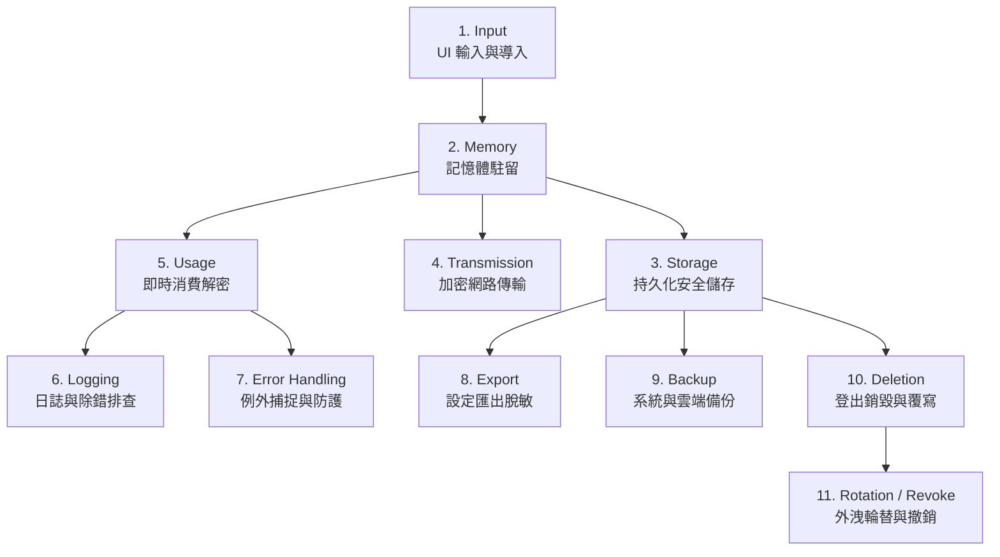

# Windows 桌面應用憑證全生命週期安全追蹤指引 (Credential Lifecycle)

一個安全的桌面應用程式，不僅要在「儲存 (Storage)」階段保護機密，更必須確保 Secret 在進入、使用、流通與銷毀的**全生命週期 (Complete Lifecycle)** 中都不發生外洩。

本文件針對 11 大關鍵生命週期節點進行深度風險剖析並提供防禦標準。

---

## 1. Input (輸入與導入階段)
- **風險場景**：
  - 使用者在 UI 介面輸入 API Key 或密碼時，若使用一般單行文字方塊（Single-line TextBox），可能被螢幕錄影、路過窺視（Shoulder Surfing）或無障礙輔助工具直接讀出明文。
  - **Windows 剪貼簿歷程記錄與雲端剪貼簿風險**：Windows 10/11 支援剪貼簿歷程記錄（`Win+V`，Clipboard History）與跨裝置雲端剪貼簿（Cloud Clipboard）。若使用者或應用程式將密鑰複製到剪貼簿，該字串可能常駐於系統歷程記錄或自動同步至雲端，被其他工具或同帳號裝置存取。
- **安全標準**：
  - [x] UI 控制項強制啟用密碼模式（如 WPF `PasswordBox`、Qt `QLineEdit::Password`、Web `<input type="password">`）。
  - [x] **剪貼簿防護標記 (Clipboard Metadata Flags)**：若應用程式必須提供複製 Token 功能，應於剪貼簿資料加入 Windows 專用格式標記，以防止進入歷程與雲端同步：
    - `ExcludeClipboardContentFromMonitorProcessing`：阻止剪貼簿監控程式處理。
    - `CanIncludeInClipboardHistory`（設為 0 / DWORD 0）：阻止進入 `Win+V` 歷程列表。
    - `CanUploadToCloudClipboard`（設為 0 / DWORD 0）：阻止同步至微軟雲端剪貼簿。
  - [x] 限制或監控剪貼簿貼上行為；若複製敏感數值，應於 30 秒至 1 分鐘後自動覆蓋或清空剪貼簿，切勿將剪貼簿當作安全可靠的憑證傳遞管道。

---

## 2. Memory (記憶體駐留階段)
- **風險場景**：在多數高階語言（如 C#、Java、Python、JavaScript）中，字串具備**不可變性 (String Immutability)**。一旦將 Secret 宣告為 `string`，該字串會在託管堆積 (Heap) 中長期滯留，等待 Garbage Collector 回收，期間可透過 Process Memory Dump 直接擷取。
- **安全標準**：
  - [x] 在 C/C++ 中，處理完敏感資料後，立即呼叫 `SecureZeroMemory` 或 `memset_s` 清除記憶體緩衝區。
  - [x] 在現代 .NET / C# 中，**Microsoft 已不建議在新的 .NET 開發中使用 `SecureString`**（Microsoft does not recommend SecureString for new .NET development）。重點在於不建議作為現代 .NET 新開發的安全策略，而非 API 已不存在。應優先縮短明文生命週期，減少不必要的字串複製；盡量以可變緩衝區（如 `byte[]`、`Span<byte>`）承載機密資料，並在消費完畢後立即以 `Array.Clear()` 清零。同時需理解：一旦轉換為 `string`，該字串物件將留存在託管堆積中，清理 `byte[]` 僅能消除該份緩衝區，無法代表託管環境內所有明文副本均已清除。
  - [x] 避免將 Secret 宣告為全域靜態常數 (Global Static Variable) 常駐於記憶體中。

---

## 3. Storage (持久化儲存階段)
- **風險場景**：明文持久化於 AppData、JSON、INI、SQLite，或在呼叫加密庫失敗時 Silent Fallback 到明文。
- **安全標準**：
  - [x] 強制採用 Windows Credential Manager 或 Windows DPAPI (CurrentUser)。
  - [x] 嚴禁 Silent Fallback to Plaintext，失敗時一律 Fail-Closed。
  - [x] 詳見 [references/windows-secret-storage.md](windows-secret-storage.md)。

---

## 4. Transmission (網路傳輸階段)
- **風險場景**：在發起 HTTP 請求時使用未加密的 HTTP 通道、將 Secret 放於 URL Query String 中被 Proxy / Access Log 記錄、或關閉 TLS 憑證驗證。
- **安全標準**：
  - [x] 強制使用 TLS 1.2 或 TLS 1.3 HTTPS 通道。
  - [x] 嚴禁禁用憑證驗證（如禁止 `ServerCertificateValidationCallback = true`、`verify=False`、`rejectUnauthorized: false`）。
  - [x] Secret 必須透過 HTTP Authorization Header（如 `Authorization: Bearer <token>`）傳送，**嚴禁置於 URL 查詢參數**。

---

## 5. Usage (消費與使用階段)
- **安全標準**：
  - [x] **延遲解密原則 (Just-In-Time Decryption)**：僅在即將發起 API 呼叫的最後一刻才從 Credential Manager 或 DPAPI 解密出明文。
  - [x] 使用完畢立即釋放或清空局部變數，盡可能縮短機密以明文狀態暴露於記憶體的時間窗口。

---

## 6. Logging (日誌與輸出階段)
- **風險場景**：開發者在除錯時撰寫 `log.Debug($"Request Auth: {apiKey}")`，日誌被輸出到使用者磁碟、主控台或隨 Telemetry 上傳至第三方日誌雲。
- **安全標準**：
  - [x] 實作日誌脫敏過濾器 (Log Masking Filter)：自動比對 `token`、`key`、`secret`、`password` 等關鍵字，將值遮罩為 `****` 或僅保留前 4 碼與後 4 碼。
  - [x] 發布版本 (Release Build) 必須禁用詳細除錯輸出，確保終端機與 DevTools Console 不輸出敏感數值。

---

## 7. Error Handling (例外捕捉與防護)
- **風險場景**：API 請求失敗拋出 `WebException` 或 `HttpRequestException`，例外訊息中包含了帶有 API Key 的連線字串或完整的 HTTP Request Body，被記錄至崩潰檔案 (Crash Dump)。
- **安全標準**：
  - [x] 捕獲例外時，對錯誤訊息進行清洗，確保拋至外層或顯示於 UI 的訊息不含敏感金鑰。
  - [x] 崩潰報告模組（Crash Reporting / Sentry）在打包記憶體資訊前，必須經過脫敏過濾。

---

## 8. Export (設定匯出階段)
- **風險場景**：桌面應用提供「匯出設定」功能（例如匯出為 `settings.json` 或 `settings.zip` 供使用者備份或移轉電腦），許多程式會無意識地將 API Key 與 Token 一併序列化匯出為明文。
- **安全標準**：
  - [x] **白名單序列化**：匯出功能必須明確採用白名單挑選非敏感 Preference（如主題、字型、視窗），預設剝除 (Strip) 所有 Secret。
  - [x] 若使用者刻意要求備份帳號憑證，必須要求使用者設定高強度密碼，使用獨立的 AES-GCM / PBKDF2 進行加密封包保護，並跳出顯式資安確認對話盒。

---

## 9. Backup (系統與雲端備份)
- **風險場景**：Windows 10/11 的 OneDrive「已知資料夾備份」或使用者第三方同步軟體會自動同步 `%APPDATA%` 或 `Documents`。若機密存為明文，會悄悄被上傳至雲端硬碟。
- **安全標準**：
  - [x] 採用 DPAPI `CurrentUser` 保存之加密密文，當檔案被同步至 OneDrive 或備份至外接儲存時，**能顯著降低離線洩漏風險**，因為其他電腦或未授權帳號缺乏該本機使用者之 DPAPI Master Key。但需注意這並非絕對防禦：若使用者的 Windows 帳號整體受損、使用漫遊設定檔 (Roaming Profiles) 或機器復原金鑰洩漏，加密防護可能隨之受威脅。

---

## 10. Deletion (銷毀與註銷階段)
- **風險場景**：使用者點擊「登出」或「刪除帳號」後，軟體僅清空前端 UI 狀態，本地磁碟與 Windows 憑證庫仍殘留歷史憑證。
- **安全標準**：
  - [x] 呼叫 `CredDeleteW` 清除 Windows Credential Manager 憑證項。
  - [x] 對於磁碟上的 DPAPI 加密檔案，執行正常檔案刪除（如 `File.Delete`、`fs.unlink`）作為應用程式生命週期清理。
  - [!] **儲存媒體限制認知**：在現代 Windows、NTFS 日誌檔案系統與 SSD（具備損耗平衡 Wear Leveling 與寫入放大機制）環境下，應用層的檔案覆寫（如 WriteAllBytes 填 0）**無法保證**物理儲存層資料不可復原。因此：
    - 若 Secret 曾經明文落地，必須依威脅模型評估外洩風險。
    - 對於已暴露或可能受損之憑證，**唯一的可靠防禦是至伺服端進行輪替 (Rotate) 與撤銷 (Revoke)**，絕不能依賴磁碟覆寫作為安全萬靈丹。
  - [x] 通知遠端 IdP 撤銷 Token（RFC 7009）。

---

## 11. Rotation / Revoke (外洩輪替與撤銷)
- **判定標準（依暴露風險綜合評估）**：
  機密是否必須強制輪替，取決於實際暴露途徑與威脅情境，而非單一機械化規則：
  - **核心評估維度**：
    - **暴露媒介**：是否進入 Git / Git 歷史紀錄？是否寫入日誌 (Log)、Telemetry 或 Crash Dump？是否被雲端同步軟體備份？是否在公開 Issue、討論區或截圖中揭露？是否有不受控之第三方可讀取？
    - **機密特性**：機密權限範圍（只讀 vs 具備完全管理權限）、機密有效期限（短期 Token vs 長效 API Key / 密碼）、當前是否已自然過期？
    - **環境狀態**：暴露持續時間長短、主機是否曾遭惡意程式感染或遺失失竊？
  - **處置判定準則**：
    - **預設 Rotation Required = Yes**：若機密曾進入 Git 歷史、Log/Telemetry、公開分享、或不受控之外部/雲端同步，一律判定為已受侵害，必須立即輪替。
    - **依威脅模型評估 (Threat-Model Dependent)**：若機密僅曾短暫以明文存在於本機儲存（例如未加密的 local temp/config），且能確認從未被外部同步、未被第三方存取、主機未受損且環境受控，可依威脅模型評估決定是否強制輪替（不必一律判定為 Yes），但仍須立即修正本地儲存架構。
- **強制處置 SOP（當判定需輪替時）**：
  1. **認定妥協**：立即視該金鑰為「已完全洩漏 (Compromised)」，不得繼續信任。
  2. **伺服端撤銷 (Revoke)**：至服務控制台（如 Google Cloud Console、OpenAI Dashboard）將該 Key 立即作廢。
  3. **更換新憑證 (Rotate)**：重新產生金鑰並透過 Windows 安全機制重新寫入。
  4. **清洗歷史**：若存在於 Git 歷史，使用 `git-filter-repo` 或 BFG Repo-Cleaner 徹底擦除該字串與 Commit 節點。
